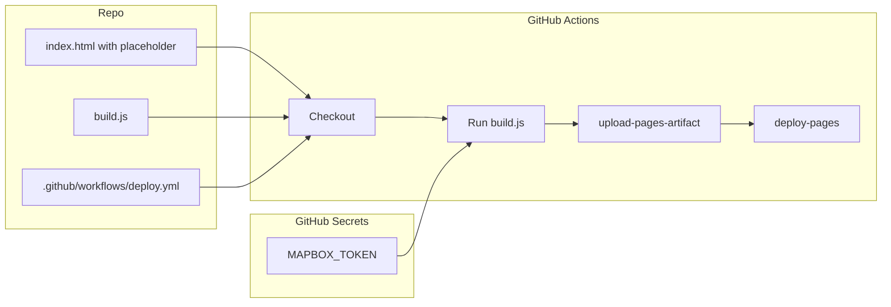

# Build Step + GitHub Actions for Mapbox Token

## Goal
Inject `MAPBOX_TOKEN` from GitHub Secrets at deploy time. Token never committed.

## Flow



## 1. Placeholder in index.html

Replace line 57:
```js
mapboxgl.accessToken = 'pk.eyJ...';
```
with:
```js
mapboxgl.accessToken = '__MAPBOX_TOKEN__';
```

## 2. Build script

Create `build.js` (Node, no deps):

```js
const fs = require('fs');
const path = require('path');

const token = process.env.MAPBOX_TOKEN;
if (!token) {
  console.error('MAPBOX_TOKEN env var required');
  process.exit(1);
}

const src = path.join(__dirname, 'index.html');
const out = path.join(__dirname, 'dist', 'index.html');
const html = fs.readFileSync(src, 'utf8').replace('__MAPBOX_TOKEN__', token);

fs.mkdirSync(path.dirname(out), { recursive: true });
fs.writeFileSync(out, html);
console.log('Built dist/index.html');
```

## 3. GitHub Actions workflow

Create `.github/workflows/deploy.yml`:

```yaml
name: Deploy to GitHub Pages

on:
  push:
    branches: [main]

permissions:
  contents: read
  pages: write
  id-token: write

concurrency:
  group: pages
  cancel-in-progress: true

jobs:
  build:
    runs-on: ubuntu-latest
    steps:
      - uses: actions/checkout@v4
      - uses: actions/setup-node@v4
        with:
          node-version: '20'
      - run: node build.js
        env:
          MAPBOX_TOKEN: ${{ secrets.MAPBOX_TOKEN }}
      - uses: actions/upload-pages-artifact@v3
        with:
          path: dist

  deploy:
    needs: build
    runs-on: ubuntu-latest
    environment:
      name: github-pages
      url: ${{ steps.deploy.outputs.page_url }}
    steps:
      - uses: actions/deploy-pages@v4
        id: deploy
```

## 4. Repo setup

1. **Add secret:** Settings → Secrets and variables → Actions → New repository secret → `MAPBOX_TOKEN` = your `pk.eyJ...` token

2. **Enable Pages from Actions:** Settings → Pages → Build and deployment → Source: **GitHub Actions**

3. **First deploy:** Push to `main`; workflow runs automatically

## 5. Local dev

- Keep a dev token in `index.html` for local testing, or
- Run `MAPBOX_TOKEN=pk.your.token node build.js` and open `dist/index.html`

## Files to create/modify

| File | Action |
|------|--------|
| [index.html](index.html) | Replace token with `__MAPBOX_TOKEN__` |
| build.js | Create (new) |
| .github/workflows/deploy.yml | Create (new) |
| README.md | Add "Add MAPBOX_TOKEN to repo secrets" |

## Optional: .gitignore

Add `dist/` if you ever run build locally and don't want to commit it (not required for Actions-only).
